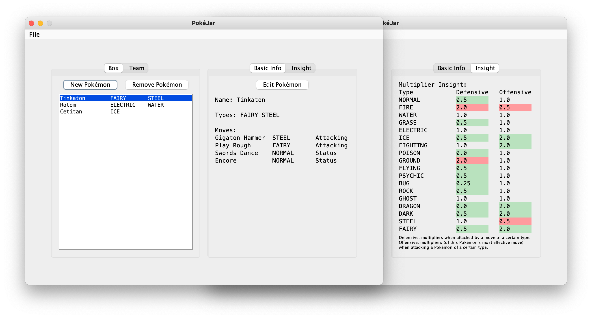
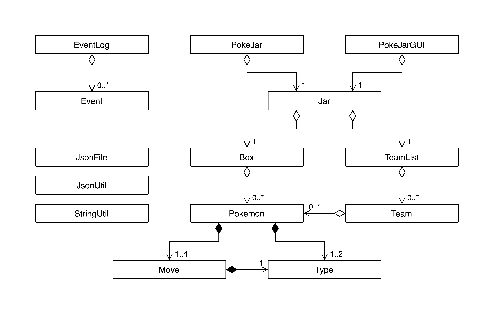

## <picture></picture>

CPSC 210 Personal Project



## Phase 0-2: Project Idea and User Stories

### What?

PokéJar is an application designed to store and analyze Pokémon and Pokémon teams.

### Why?

This project is of interest to me because I've recently gotten my first Pokémon game &mdash; Pokémon Violet.
As a new player, an analytics toolset would make it so much easier for me to master my Pokémon game.

### Who?

The targeted user group of this app are Pokémon trainers.

### User Stories

- [x] As a user, I want to be able to add my Pokémon to my box
- [x] As a user, I want to be able to remove Pokémon from my box
- [x] As a user, I want to be able to edit the attributes of each Pokémon
- [x] As a user, I want to be able to view and analyze each Pokémon
- [x] As a user, I want to be able to form multiple teams with my Pokémon
- [x] As a user, I want to be able to remove teams from a list of teams
- [ ] As a user, I want to be able to switch Pokémon in and out from my teams
- [x] As a user, I want to be able to view and analyze my teams
- [x] As a user, I want all current app data to be autosaved when I close the app
- [x] As a user, I want my autosave to be automatically loaded when I open the app
- [x] As a user, I want to be able to save all current app data to a json file
- [x] As a user, I want to be able to load a saved app state from a json file

## Phase 3: Instructions for Grader

### UI Summary

- The PokéJar UI is composed of a left tabbed pane and a right tabbed pane.
- The left pane is used to manage your box, i.e. list of Pokémon, and teams (to be implemented in the future).
- The right pane is used to see the basic info of your Pokémon, to see a generated insight about your Pokémon, as well as to edit your Pokémon.

### Step-by-step Instructions

#### Opening (Visual Component)

- Every time you open the app, a cool custom-made splash screen appears for three seconds before the app is launched.
- Then, data/autosave.json will be automatically loaded to the app to retrieve the save state when you last closed the app.

#### Adding and Editing Pokémon (Action 1)

- Press the Add Pokémon button to add a new Pokémon to your box. The new Pokémon will have no name, no type, and no moves.
- In order to edit your brand new Pokémon, press the Edit Pokémon button in the Basic Info tab.
- The Basic Info tab will be replaced by the Edit Pokémon tab to allow you to edit your Pokémon's name, types, and moves.
- As you type into the name field or choose the Pokémon's type, you can see live changes to your box on the left pane.
- You can choose to give this Pokémon sick moves by pressing the Add Move button. You will then be prompted with a series of popup windows to set up your move.
  - The number of types is limited to two and the number of moves is limited to four, buttons and checkboxes will be disabled to prevent exceeding these limits.
- After you are done with customizing your Pokémon, click Done to return to the Basic Info tab. All info will be updated to reflect changes.

#### Analyze Pokémon

- Click the Insight tab to gain insight into the selected Pokémon's offensive and defensive multipliers generated based on their types and moves. 
  - There are some footnote explaining this analysis below the multiplier table. 
- Feel free to add new Pokémon or edit your existing Pokémon to see how their insight change. Use this tool to build your ultimate Pokémon. 

#### Removing Pokémon (Action 2)

- You can remove a Pokémon by selecting it and then pressing the Remove Pokémon.

#### Saving

- Once you are satisfied with your box of Pokémon, click File > Save As on the menu bar to bring up a prompt to save the current state of the app to a JSON file anywhere you choose.

#### Loading

- By clicking File > Load File, a prompt will show up to let you choose any valid save file on your computer to be loaded directly into the app's interface.

#### Closing

- When you close the app, the state of the app will be automatically saved to data/autosave.json to be restored the next time you open the app.

## Phase 4: Event Logging and Design Reflection

### Task 2: Event Log Sample

```
Fri Mar 31 12:55:10 PDT 2023
Pokemon New Pokémon added to box.
Fri Mar 31 12:55:12 PDT 2023
Pokemon Rotom removed from box.
Fri Mar 31 12:55:13 PDT 2023
Pokemon New Pokémon added to box.
Fri Mar 31 12:55:14 PDT 2023
Pokemon New Pokémon added to box.
Fri Mar 31 12:55:17 PDT 2023
Pokemon Tinkaton removed from box.
Fri Mar 31 12:55:19 PDT 2023
Pokemon Cetitan removed from box.
```

### Task 3: Design Reflection

#### UML Diagram



The diagram follows a tree-like structure with 
associations generally pointing in one direction.
There are no interfaces and abstract classes in the program.
The coupling is loose and the cohesion is high 
for the most part since the program is relatively small,
though there are still many things that could be improved. 

#### Refactoring Possibilities

In my opinion, what would benefit this program the most 
is to, instead of having everything in one class, 
refactor each component that make up the GUI into their own classes
while allowing them to update each other through a main class
which they all have bidirectional relationships with.
This would increase the cohesion of the program 
without introducing too much coupling. 
The benefits would be even more amplified when 
more functionalities such as Team management are added.